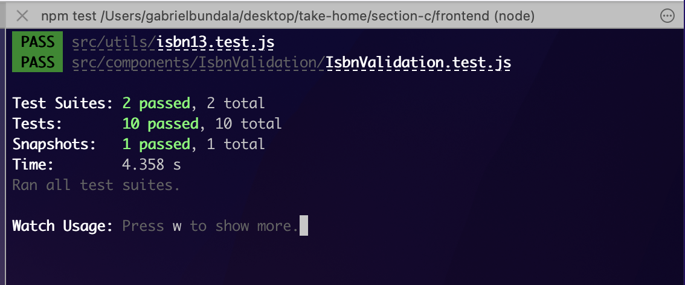

# ISBN-13 Validation

## Table of Contents

1. Installing, testing and using the application
2. Frontend part of the application
3. Justification of the worst-case space complexity
4. How to use the application

## Installation, testing and using the application

This application includes only the frontend created with ReactJS.

If you need to see this application in action in development mode you can download the source files in your local environment then `cd` into the `frontend` directory and **`npm install`** to install the dependencies. Then you can start the server with **`npm start`**. This command will run the npm script in development mode that will be restarting the server on each change you make in the code. Then navigate to http://localhost:3000/.

You may also clone the repo from https://github.com/gbundala/marketplace-reviewer-task into your local environment or download the zip file from Github and follow the steps above.

To test the application, `cd` into the `frontend` directory from the root directly and follow the following steps to start testing application by running **`npm test`** then Press **`a`** to run all tests which will run all the test cases and give the results on the command line like the image below.

Once all the tests pass then you are good to go and you can move on the next steps in development such as reviewing the code and committing changes to your repo for a Pull Request (PR).

## Frontend part of the application

The frontend is created with ReactJS. Currently there is only one component, the IsbnValidation component handles all the business logic of accepting user input, managing state and calling the `isbn13()` method that is key to the overral project task here.

`React-Bootrap` has been used to enhance styling and structure of the page and the link element has been called at the top level `App.js` component to ensure that the entire app get appropriate Bootstrap styling immediately on start up of the page.

## Worst-Case Space Complexity

Space complexity refers to the memory space taken by the algorithm with respect to the size of the input into the algorithm which includes both the temporary space occupied by the algorithm (also referred to as the Auxilliary space) as well as the space used by the input.

In analysing the performance complexity of an algorithm we use the `Big-O Asymptotic Notation` where in general cases we assess and compare the worst-case theoretical complexities for performance analysis. The fastest possible running algorithm is the denoted as `O(1)` referred to as `Constant Running Time`. In our case the O(1) refers to the most efficient algorithm in **`memory space usage`**.

In respect of the solution for this task, the ISBN validation algorith, to measure the space complexity we look at how much extra space is needed in order to hold all the information necessary to execute the validation algorithm which in this case we determine the space needed to store;

1. The values in the loop used to make temporary calculations
2. the value of i, j or any other temporary variable, and
3. any other necessary data to the computation such as the counter

In the solution, the algorithm for validating ISBN-10 uses variables `i` and `j` where the counter adds one to `i` and deducts one from `j` on each iteration. In this case hence both the variables `i` and `j` as well as the counter and any other data in the computation takes up **`O(1)`** space.

In each iteration of the loop the program would need to use **`O(1)`** of space for the temporary variables defined in the body of the for loop, however this space will be reused on each iteration since because they would not exist simulataneously on the call stack, hence after each loop finishes running, the space for the temporary variables is no longer needed anymore and can therefore be re-used in the next iteration. Therefore regardless of how large the size of the array of the characters of the input string the space would remain to be **`O(1)`** .

The algorithm for converting a valid ISBN-10 to an ISBN-13 and the algorithm for validating an ISBN-13 are both having the same structure as above and much better with only a single iterating variable `i` hence the overall algorithm would only take **`O(1)`** of space.

In addition, the algorith for converting an ISBN-10 to ISBN-13 uses a constant as its maximum for the variable `i`. Also the algorithm to test the validity of ISBN-13 two routes inside the body of the for loop defined by the if statement. Both of these aspect further simplifies the performance and execution of the algorithms and hence maintains the space used to only be **`O(1)`** .

Therefore, the algorithm used in this case is the most efficient in memory space usage in the worst case scenario. It is therefore a good algorithm design.

## How to use the application

Refer to the installation part at the beginning of this README to get to know how to install the application if you need to use it in your local environment in the browser.

ISBN-13 Validation application provides you with the User Interface to be able to enter an ISBN-13 and immediately get a response whether it is valid or invalid. If you enter an ISBN-10 and is valid, the algorithm will convert it into an ISBN-13 and return it. If it is invalid it will immediately respond with "Invalid" response.

To get the response on your ISBN string, just enter the string in the input section and click the `Verify ISBN-13` button and voila!

> Enjoy ISBN Validation!
